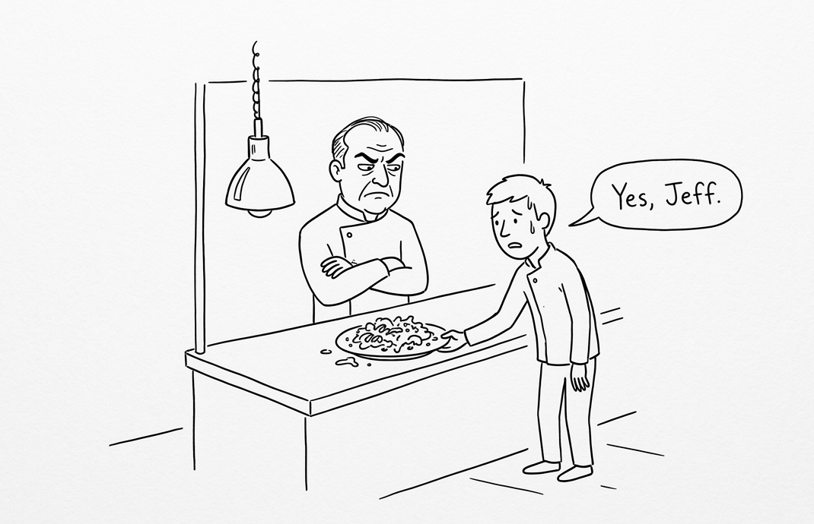
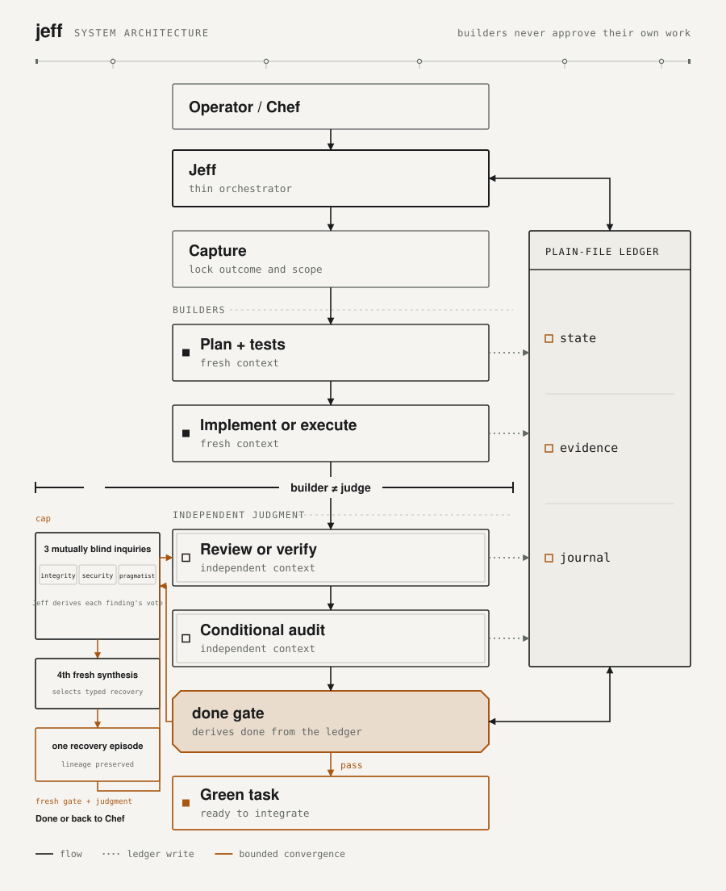
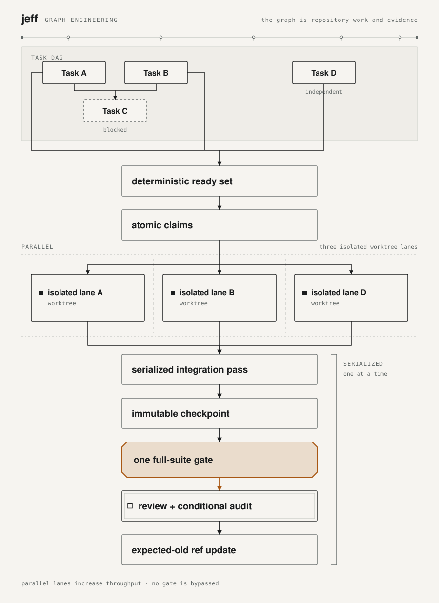
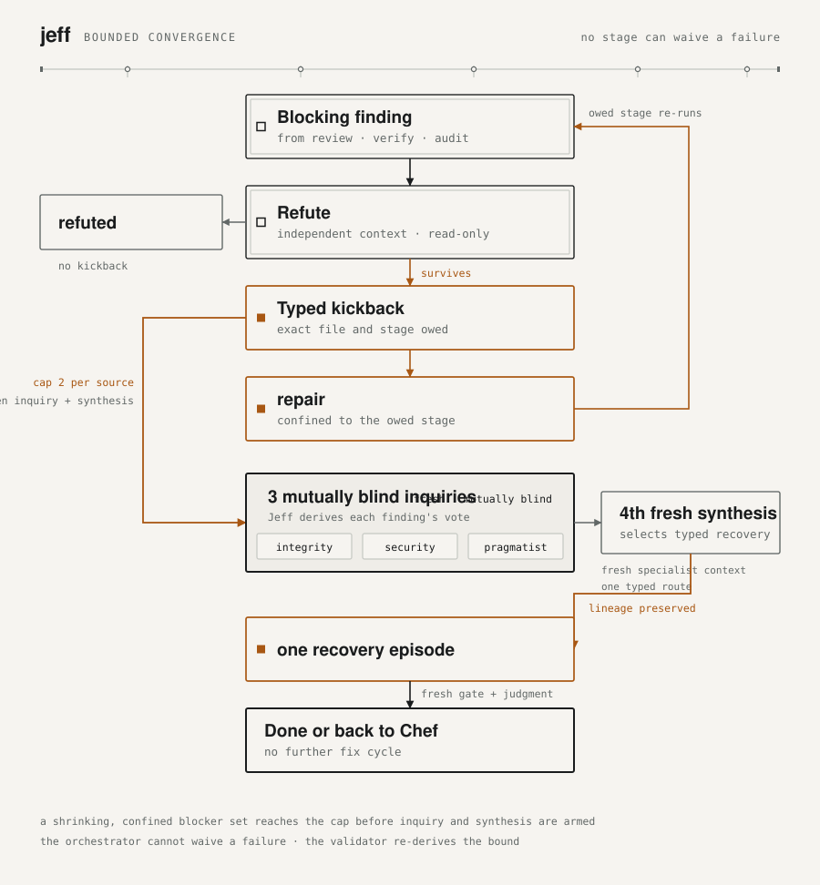

# jeff

> A model-native quality control plane for agentic software work.



Jeff turns software work by frontier models into an inspectable engineering
process. A thin orchestrator routes atomic tasks through fresh specialist
contexts; builders never approve their own work; evidence survives outside the
chat; and a checked control plane decides whether each task is actually done.

The method is the product. Jeff supplies the quality lifecycle inside the
coding clients, model providers, and runtime systems you already use, while its
plain-file ledger keeps the process inspectable across sessions.

Five invariants carry the system:

1. **Fresh context per stage.** Planning, implementation, review, verification,
   and audit do not inherit a long, degraded conversation.
2. **Builder is not judge.** Test author, implementer, reviewer, executor, and
   verifier identities are mechanically separated where their roles conflict.
3. **Evidence is durable.** Task state, findings, approvals, test results, and
   dispatch provenance live in an inspectable ledger, not only in a transcript.
4. **Gates are deterministic.** Checked JavaScript validates legal stage graphs,
   identity separation, required evidence, convergence bounds, and completion.
5. **Disagreement is bounded.** Typed kickbacks, independent refutation, and one
   task-wide council converge without letting the orchestrator waive a failure.

Jeff is a cooperative protocol for one trusted operator and friendly agents,
not a security sandbox or hostile-child containment system. It validates the
method's state and contracts; tool isolation remains a property of each host.

## Status

Jeff is finished and no longer under development. The method works, the gates
hold, and the code is stable. What it does not have is a maintainer adding to
it, so read it as a complete system rather than an active project.

[What Jeff built](#what-jeff-built) records where the method ran, what it
caught, and what it cost. The graph and control-plane track moved to
[jeff-control](https://github.com/johanthoren/jeff-control), also frozen.

## Architecture

The kitchen is the interface, not the mechanism. You are the Chef. Jeff is the
sous chef that routes the order and holds the pass. The brigade consists of
fresh specialists, one station at a time.

<picture>
  <source media="(prefers-color-scheme: dark)" srcset="docs/img/architecture-dark.svg">
  
</picture>

The control plane is deliberately boring. `src/cli/cook.js` is the sole
operational entry point. The authoritative validator imports only Node's
standard library and `src/core/*`; there is no build step or runtime package
dependency inside the validation boundary. Models supply judgment. Checked
code supplies legality.

## Two closed completion graphs

Capture interviews one question at a time. It records the destination, then
locks only the confirmed now increment and the task's primary outcome.
Inspired by Matt Pocock (MIT; see `NOTICE`).
The bundled YAGNI ladder is adapted from ponytail (MIT; see `NOTICE`). Loading the [ponytail](https://github.com/DietrichGebert/ponytail) plugin beside Jeff is recommended; Jeff does not require it.
Code and operations then follow different graphs:

```text
code       capture → plan + tests → implement → conditional refactor
                                      → review + conditional audit → done

operation  capture → plan → execute → verify + conditional audit → done
```

Code planning owns the proof and starts RED when behavior changes. A separate
implementer makes it green. Jeff then binds one full-suite run to an immutable
checkpoint before independent judgment. Operation planning instead defines a
bounded runbook, recovery boundary, exact approval boundary when needed, and
deterministic postconditions. A separate verifier observes every postcondition
in order. Executor evidence never substitutes for verification.

No active specialist can declare the whole task done. The validator derives
that result from the ledger.

## Graph Engineering

Jeff 6.0 applied graph-engineering semantics to the work itself without
adopting a graph runtime or weakening a quality gate:

  independently shippable outcomes into atomic tasks. `deps` alone schedules;
- **Expose real width.** Capture applies a fake-edge test and splits
  `discoveredFrom` records provenance without inventing dependencies.
- **Drain the task DAG.** `cook ready`, `claim`, `claims`, and `release` provide
  deterministic ready-set and atomic-claim primitives. Full-mode `cook all`
  runs independent lanes in isolated worktrees, then serializes integration
  against a gated checkpoint with an expected-old ref update.
- **Remove false serialization.** Independent judgments and source-bound
  refutations fan out concurrently.
- **Carry facts, not conclusions.** An optional facts-only `context.md` gives
  each cold specialist a verified repository map while keeping judgment
  independent.
- **Make resume deterministic.** An append-only `journal.jsonl` writes intent
  before specialist dispatches and external effects, so interruption does not
  become ambiguous replay.
- **Repair the failed node.** Typed findings identify the exact file and stage
  owed. A file-confined repair can retain an independently passing sibling
  judgment, while the full-suite gate always reruns.
- **Scale escalation with evidence.** A shrinking, confined blocker set can
  earn one bounded bonus cycle. Divergence still reaches a three-member
  council, and the validator re-derives the bound.
- **Project state safely.** `cook snapshot --json` exposes an additive,
  versioned, read-only machine projection for graph clients and other
  observers, even when the underlying store is invalid.

<picture>
  <source media="(prefers-color-scheme: dark)" srcset="docs/img/graph-engineering-dark.svg">
  
</picture>

### Bounded convergence

At the cap, Jeff dispatches three fresh, mutually blind inquiry specialists and deterministically derives each finding's vote result. A fourth fresh synthesis specialist selects one typed recovery route. The one bounded recovery episode preserves the original lineage, runs the applicable fresh gate and judgment round, then either completes the task or returns it to the Chef.

<picture>
  <source media="(prefers-color-scheme: dark)" srcset="docs/img/convergence-dark.svg">
  
</picture>

The detailed contracts and tradeoffs are recorded in the
[6.0 Graph Engineering slate](https://github.com/johanthoren/jeff/blob/main/docs/specs/graph-slate-6.0.md). The
[machine projection](skills/cook/reference/jeff-state-schema.md#snapshot-projection)
is also the boundary [jeff-control](https://github.com/johanthoren/jeff-control)
reads through, keeping schema knowledge in this repository.

## Position in the ecosystem

Jeff is designed to sit beside existing clients and orchestration systems. Each
keeps ownership of the layer it is built to solve.

| Adjacent system | Primary concern | Jeff's boundary |
|---|---|---|
| Claude Code, Codex, Cursor, Grok Build, Pi, and Oh My Pi | Interactive coding and native specialist execution | Jeff supplies one host-neutral method, ledger, and done-gate across their different dispatch mechanics. |
| Claude, GPT, and Grok model families | Reasoning and software-engineering judgment | Jeff inherits the orchestrator's active model by default and records actual provider, model, and effort as execution evidence. |
| LangGraph, Microsoft Agent Framework, Mastra, and Pydantic AI | Application-level agent graphs and runtime orchestration | These systems retain runtime ownership; Jeff controls the quality lifecycle of repository tasks. |
| Temporal, Restate, and DBOS | Durable execution and distributed workflow recovery | Jeff uses a local append-only journal and plain-file state for a narrower, single-operator engineering protocol. |
| Gas Town, beads, OpenHands, and fleet orchestrators | Task coordination, agent fleets, and throughput | Jeff borrows ready-set, claim, isolation, and projection semantics while retaining mechanical builder/judge separation and completion proof. |

The mid-2026 field survey positioned Jeff around one specific combination:
fresh-context judgment, mechanically enforced builder/judge separation, durable
task evidence, and a deterministic completion gate. Adjacent systems lead in
execution, durability, observability, and throughput. See the
[survey and design record](https://github.com/johanthoren/jeff/blob/main/docs/specs/graph-slate-6.0.md).

## What Jeff built

Jeff ran the task flow on three private applications through July and August
2026: a subscription strength-training app for iPhone and Apple Watch, a
transcription tool, and a native macOS dashcam footage manager. Between them
they carry a few thousand commits, and the shape Jeff imposes is visible in
their history: one issue per branch, a failing test committed before the fix
that turns it green, and independent review before a merge.

The clearest single record is [issue
#234](https://github.com/johanthoren/jeff/issues/234), observed on the
training app on 2026-08-11. Six tasks implemented by an external agent passed
three distinct reviewer agents, with every red case either traced or proven by
a constructed vacuous mutation, one task additionally security-audited, zero
blocking findings, and a green full-suite gate. They still could not reach
done, because the test author and the implementer were the same identity and
the invariant refuses that with no recorded escape. The operator had to ratify
a disclosed deviation by hand.

That episode is the method working and the method costing something at the same
time. Review caught what the invariant existed to catch, and the invariant
still blocked. It is a real limit rather than a bug: the gates are mechanical,
so work whose shape the pipeline did not anticipate needs an operator to
adjudicate. A typed waiver carrying the verifying reviewer's identity was
designed and never built.

The identity check had a second, quieter cost. Specialists cannot observe their
own dispatch id, so the first `cook record` of every stage failed and had to be
retried, which added six extra dispatches to a single task during the
context-engineering arc.

All three projects removed Jeff on 2026-08-29 and now track work with GitHub
issues and in-repo documentation. Their agent instructions say not to recreate
a `.jeff/` store.

The tradeoff is the part worth taking. Jeff buys a completion proof and
evidence that outlives the transcript, and charges a round trip per stage to
do it. That is a fair price where someone may later ask what happened and the
answer has to be checkable rather than remembered. It is a poor price when the
work is moving quickly and the operator is the only reader it will ever have.
Fast-moving work is better served by lighter, prompt-level tooling, and that
is where this author's went:
[pstack](https://github.com/cursor/plugins/tree/main/pstack).

The invariants held, the evidence survived outside the transcript, and three
applications shipped under the method. Jeff is what taking the strict position
seriously enough to find where it binds actually produces.

## Hosts and models

Claude Code, Codex, Cursor, Grok Build, and Pi are first-class Jeff hosts. Oh My Pi
installs the Pi package and uses its dispatch bridge. Grok Build consumes
Jeff's Claude Code-compatible plugin surface, including its agents, skills,
hooks, and marketplace metadata. A Grok Bot loads Jeff through the shipped
Cursor plugin. The adapters differ; the method, specialist contracts,
checked core, and evidence model remain shared.

Grok Build and Grok models occupy different layers. Grok Build is the coding
client; Grok 4.5 is a peer model-family design target alongside Claude Opus 5
and GPT-5.6 Sol. Jeff defaults specialist model selection to the orchestrator's
active provider and model and records the actual provider, model, and effort as
execution evidence.

Current dogfood is stamped GPT-5.6 Sol, July 2026. The stamp records operating
experience while compatibility remains host-neutral and model-open.

Host-native effort behavior remains explicit:

- Pi and Claude Code apply role-frontmatter effort where supported.
- Grok Build consumes the Claude Code-compatible agent definitions through its
  native subagent runtime.
- Codex specialists inherit orchestrator effort.

## Install

Jeff is one versioned package with first-class install surfaces for each host.
Node.js `>=22.19.0` is required by the Pi dispatch SDK.

### Claude Code

```sh
claude plugin marketplace add johanthoren/jeff
claude plugin install jeff@jeff
```

Update the plugin, then restart Claude Code:

```sh
claude plugin update jeff@jeff
```

### Codex

```sh
codex plugin marketplace add johanthoren/jeff
codex plugin add jeff@jeff
```

Refresh the marketplace snapshot and reinstall to update:

```sh
codex plugin marketplace upgrade jeff
codex plugin add jeff@jeff
```

Restart Codex Desktop and begin a new task so it loads the updated skills.

### Cursor

Install from Customize, add the git marketplace, or load a local checkout
from `~/.cursor/plugins/local`:

```sh
agent plugin marketplace add https://github.com/johanthoren/jeff
```

Update the marketplace snapshot:

```sh
agent plugin marketplace update jeff
```


### Grok Build

Grok Build supports Claude Code-compatible plugins and can install Jeff
directly from GitHub. Git installs require an explicit trust decision. Review
the repository, then:

```sh
grok plugin install johanthoren/jeff --trust
```

Update Jeff:

```sh
grok plugin update jeff
```

An `already up to date` response means no change was needed.

### Grok Bot

A Grok Bot loads Jeff through the shipped Cursor plugin on the Cursor
account that owns the Bot. Install that plugin from Customize, or load a
local checkout from `~/.cursor/plugins/local`. Do not copy `skills/` onto
the Bot computer.

Native specialist dispatch on that Bot's computer is Grok Build plus cook,
using the existing `grok plugin` and `cook` commands. There is no Grok Bot
CLI.

Do not paste credentials into chat or ordinary files. Use the Grok Bot
secrets card.

### Pi

Install the stable npm release:

```sh
pi install npm:@johanthoren/jeff
```

Update or pin it:

```sh
pi update npm:@johanthoren/jeff
pi install npm:@johanthoren/jeff@X.Y.Z
```

For deliberate development installs from the live repository:

```sh
pi install git:github.com/johanthoren/jeff
```

### Oh My Pi

Install the stable npm release:

```sh
omp plugin install @johanthoren/jeff
```

Re-run the same command to update an npm-installed copy. `omp plugin upgrade`
is for `name@marketplace` installations.

OMP specialists do not inherit orchestration extensions, custom or MCP tools,
advisor behavior, memory/autolearn, or model fallback. Applicable user and
project `SYSTEM.md` instructions still tighten or specialize Jeff's bundled
standards floor.

### Verify installation

After an update, start a new host session, then inspect the loaded package with
the host's read-only inventory command:

| Host | Command |
|---|---|
| Claude Code | `claude plugin details jeff@jeff` |
| Codex | `codex plugin list` |
| Cursor | `agent plugin marketplace list` |
| Grok Build | `grok plugin details jeff` |
| Pi | `pi list` |
| Oh My Pi | `omp plugin list` |

Plain `npm install @johanthoren/jeff` downloads the package into
`node_modules`; it does not activate Jeff in any host.

## Set up

Activate Jeff once per repository:

- **Full mode:** for a repository whose task registry Jeff owns. Ask to set up
  Jeff, or run `cook init`. The committed `.jeff/` store carries the registry
  and full dependency graph.
- **Lite mode:** for a shared repository whose team already owns planning and
  integration. Ask to set up Jeff Lite, or run `cook lite`. The local ledger is
  git-excluded and the configured issue or plan store remains authoritative.

## Use

Describe the work normally. In an active project, the host first assesses it
without making a durable change.

- **Explore:** disposable experiments and local evidence stay ad hoc.
- **Remember:** an explicit Remember request is the consent to write durable memory without creating work.
  Full mode uses `.jeff/memory/`; elsewhere Jeff
  prefers a suitable tracked memory, decisions, learnings, or handoff file and
  preserves its purpose and format, then falls back to local `.jeff/memory/`.
  Without explicit Remember or another persistence request, ordinary work does not write durable memory.
  `AGENTS.md`, READMEs, and product documentation are not memory stores.
- **Record:** create pending future work without starting it.
- **Start:** `cook <id>` and `cook on <ref>` are equivalent forms to start or resume a recorded task through the quality pipeline.

Before the first durable write on consequential work, Jeff offers a clear
choice: ad-hoc local ship, record pending, or record and start capture. Risky
production, data, security, accessibility, release, and shared-state work
always restores that boundary.

Once tracked work starts, Jeff becomes the thin orchestrator. It routes and
records. Fresh specialists plan, build, simplify, judge, and audit. The
mechanical gate, not momentum in the conversation, decides done.

Re-fire until it's worthy.

## Read deeper

- [Design rationale](docs/specs/jeff-design.md): system boundaries, invariants,
  pipeline graphs, and checked control plane.
- [6.0 Graph Engineering slate](docs/specs/graph-slate-6.0.md): field survey,
  throughput mechanisms, targeted repair, DAG drain, and projection contracts.
- [Visual system atlas](docs/img/atlas-light.svg): Architecture, Graph
  Engineering, and bounded convergence from three mutually blind inquiry specialists through a fourth fresh synthesis specialist in one sheet
  ([dark theme](docs/img/atlas-dark.svg)).
- [State schema](skills/cook/reference/jeff-state-schema.md): persisted records
  and validator-derived invariants.
- [Operational method](skills/cook/SKILL.md): the complete orchestration loop.
- [Maintenance stance](docs/maintaining-jeff.md): pace layers, model drift, and
  design for deletion.
- [Kitchen voice](docs/brand.md): the persona as a render layer over a fixed
  technical substrate.
- [jeff-control](https://github.com/johanthoren/jeff-control): the Rust
  projection daemon and graph client, split out and likewise frozen.

Prefer plain talk? Set `JEFF_FLAVOR=plain`. A per-repository `"flavor"` value
in `.jeff/config.json` overrides the environment, and a live conversation
choice overrides both. The work and evidence are identical.
